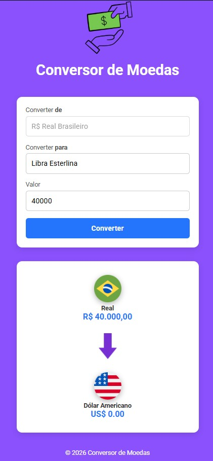

# 💱 Conversor de Moedas

🌍 Conversor de Moedas em tempo real — feito em HTML, CSS e JavaScript, com integração à ExchangeRate-API. Converta valores de Real (BRL) para diversas moedas internacionais com interface simples, responsiva e intuitiva.

Um projeto simples e funcional de **conversor de moedas online**, desenvolvido em **HTML, CSS e JavaScript**, que consome a API [ExchangeRate-API](https://www.exchangerate-api.com/) para obter cotações em tempo real.

---

## 📂 Estrutura de Pastas
```
conversor-moedas/
│
├── index.html        # Estrutura principal da página
├── style.css         # Estilos e layout
├── scripts.js        # Lógica em JavaScript (conversão e eventos)
└── assets/           # Imagens e ícones usados no projeto
├── logo.gif
├── arrow.png
├── bandeiraBrasil.png
├── bandeiraUSA.png
├── euroLogo.png
├── libraLogo.png
├── ieneLogo.png
├── australiaLogo.png
├── canadaLogo.png
└── suicaLogo.png
```

---

## 🚀 Como utilizar

1. Clone este repositório:
   ```bash
   git clone https://github.com/seu-usuario/conversor-moedas.git
Acesse a pasta do projeto:

bash
cd conversor-moedas
Abra o arquivo index.html em qualquer navegador.

Digite o valor em Reais (BRL), escolha a moeda de destino e clique em Converter.

🔑 Configuração da API
Este projeto utiliza a ExchangeRate-API.
Para funcionar corretamente, você precisa de uma API Key:

Crie uma conta gratuita em ExchangeRate-API.

Copie sua chave de API.

Substitua no arquivo scripts.js:

js
const apiKey = "SUA_CHAVE_API";
✨ Funcionalidades
Conversão de Real (BRL) para diversas moedas:

Dólar Americano (US$)

Euro (€)

Libra Esterlina (£)

Iene Japonês (¥)

Dólar Canadense (CA$)

Dólar Australiano (AU$)

Franco Suíço (CHF)

Exibição com símbolos customizados (US$, CA$, AU$ etc.).

Interface simples e responsiva.

Atualização automática das bandeiras e nomes das moedas.

📸 Demonstração



🛠️ Tecnologias utilizadas
HTML5

CSS3

JavaScript (ES6+)

ExchangeRate-API

📄 Licença
Este projeto está sob a licença MIT.
Sinta-se livre para usar, modificar e compartilhar.

```
javascript
html
css
exchange-rate-api
currency-converter
frontend
web-app
finance
real-time-data
responsive-design
```